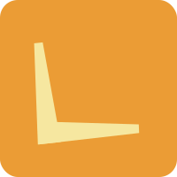

<p align="center">
  
</p>

# 💡 Lumen


**Lumen** is a minimal yet powerful Python starter template for building **applications, libraries, and CLI tools**.
It comes pre-configured with modern Python tooling to ensure clean code, consistent formatting, and reliable testing — so you can focus on building, not setup.

---

## ⚡ Features

- **Python 3.13+**: Built on the latest stable Python.
- **Pre-configured Tooling**:
  - **Poetry**: Dependency management and packaging.
  - **Ruff**: Lightning-fast linting.
  - **Black**: Opinionated code formatting.
  - **Pre-commit**: Hooks to enforce consistency before commits.
- **Pytest**: Integrated unit testing for robust codebases.
- **Developer Experience**: Clean, modular structure with minimal boilerplate.

---

## 🚀 Getting Started

### Prerequisites

Ensure you have the following installed:

- **Python**: v3.13 or later.
- **Poetry**: v1.8 or later.

---

### ⚙️ Installation

1. Clone the repository:

   ```bash
   git clone https://github.com/Kosha-Nirman/lumen.git
   cd lumen
   ```

2. Install dependencies:

   ```bash
   poetry install
   ```

3. Run the project in development mode:

   ```bash
   poetry run app
   ```

4. Run tests with:

   ```bash
   poetry run test
   ```

---

## 📜 License

This project is licensed under the MIT License. See the [LICENSE](LICENSE.md) file for details.

---

## 🙌 Acknowledgments

- Designed for developers building **Python applications and libraries**.
- Inspired by the clarity of **Lumen**, this template provides a bright start for new projects.
- Made with ❤️ to reduce setup overhead and keep the focus on development.
